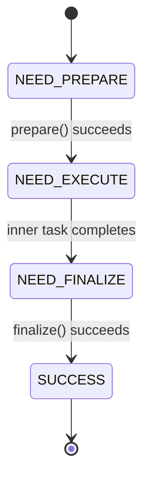
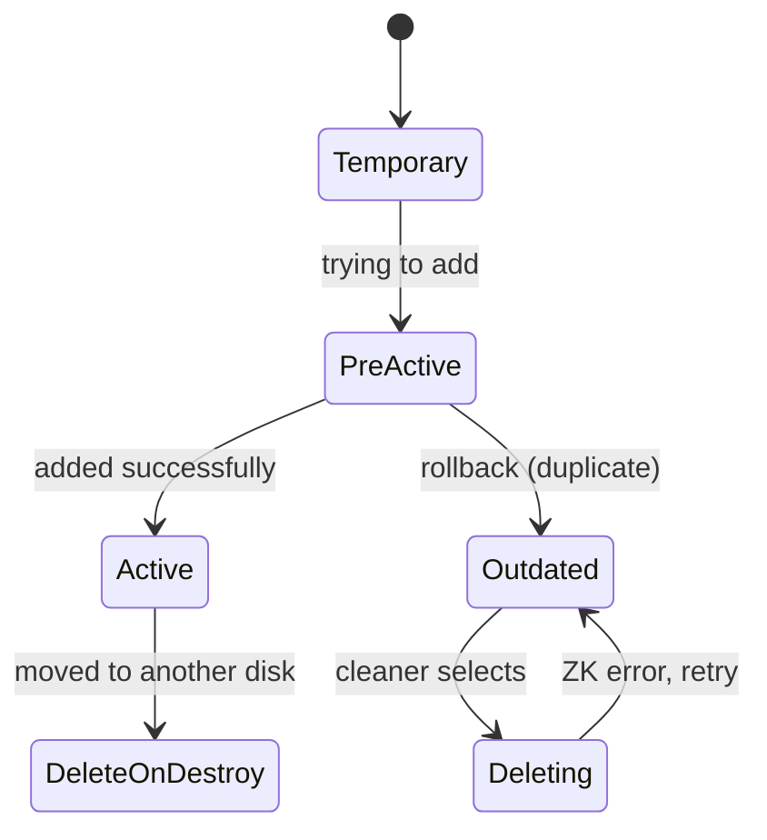
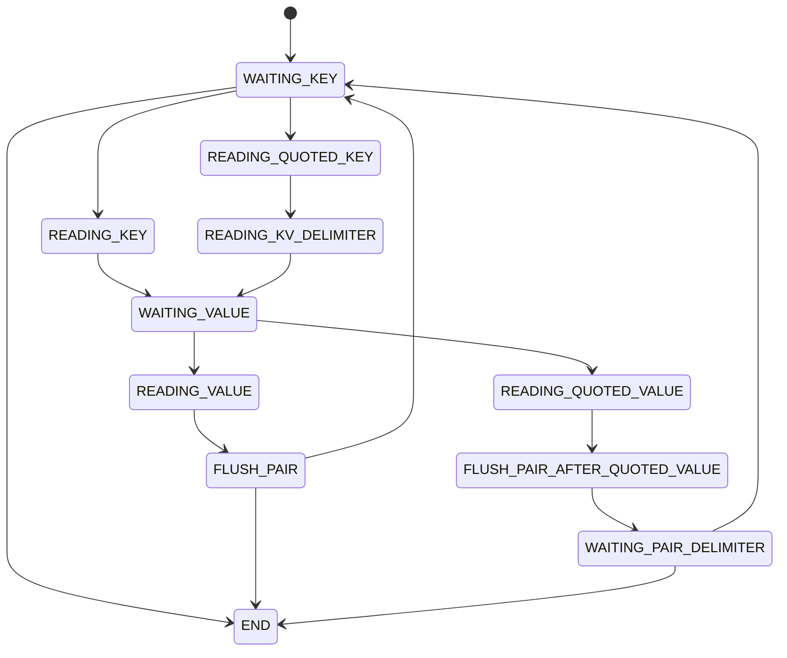
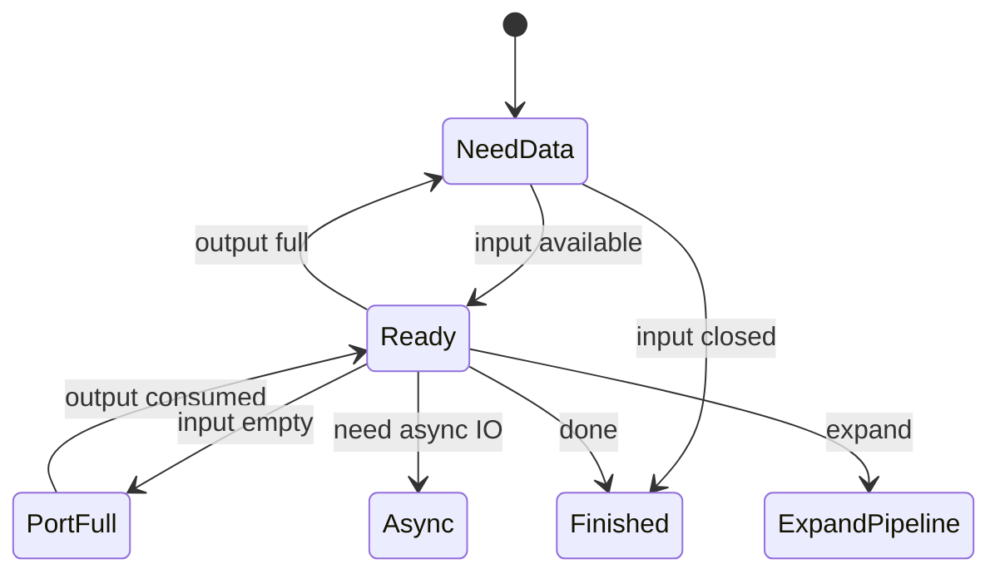
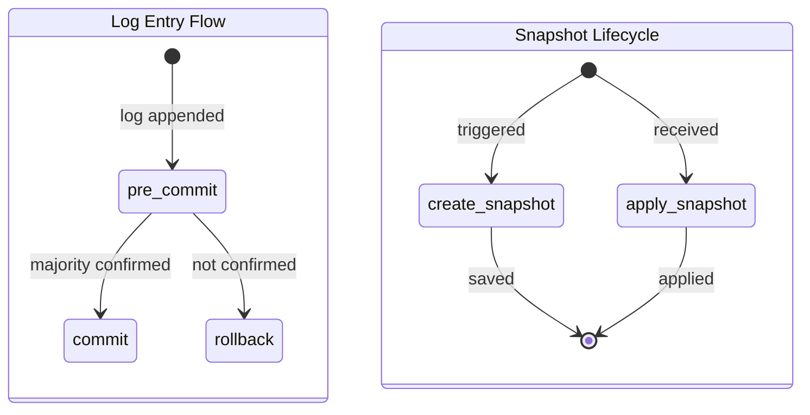
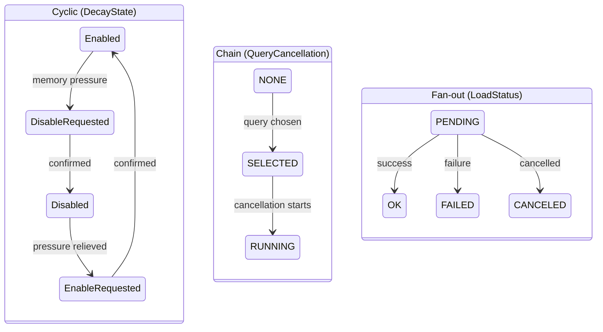
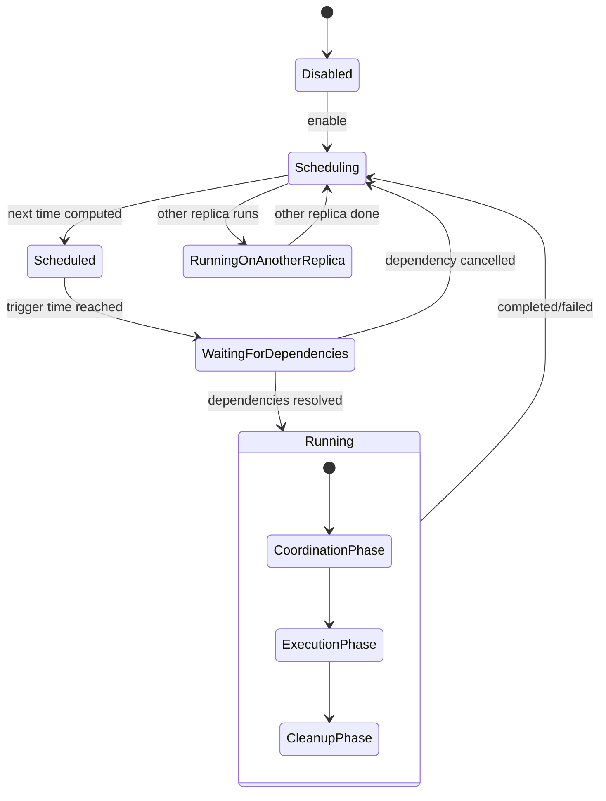

# State Machine Design Skill

Design production-quality C++ state machines by recommending one of 7 proven patterns and generating scaffolding code. All patterns are derived from systematic analysis of 27+ state machine implementations in the ClickHouse codebase.

## Arguments

- `$ARGUMENTS` (optional): A description of what the state machine should manage. If provided, extract requirements from it and skip to pattern recommendation. If empty, start the interactive interview.

---

## Pattern Knowledge Base

### Pattern 1: Linear Sequential (Phase-based)

**When to use**: A complex operation broken into ordered phases; each `executeStep()` call advances one phase.

**Examples in ClickHouse**: `ReplicatedMergeMutateTaskBase`, `MutatePlainMergeTreeTask`, `MergePlainMergeTreeTask`

**State diagram**:


**Key traits**:
- `executeStep()` returns `true` if more work remains, `false` when done
- Exceptions freeze the state (no advancement on error), enabling retry
- Calling `executeStep()` after SUCCESS throws LOGICAL_ERROR
- Perfect for background tasks that must yield control between phases

---

### Pattern 2: Lifecycle

**When to use**: A data entity with ordered stages from creation to destruction. States are mostly monotonically increasing with rare rollback.

**Examples in ClickHouse**: `MergeTreeDataPartState` (6 states), `FileSegmentState` (6 states), `MetadataStorageTransactionState` (4 states)

**State diagram** (MergeTreeDataPartState):


**Key traits**:
- All transitions documented in comments above the enum
- State modifications protected by mutex
- States are ordered (enum values increase)
- Rare rollback paths explicitly documented

---

### Pattern 3: Parser/Tokenizer

**When to use**: Character-by-character input stream processing where each state represents a parsing context.

**Examples in ClickHouse**: `KeyValuePairExtractor` (11 states)

**State diagram**:


**Key traits**:
- Each state has a dedicated handler method returning `NextState{position, state}`
- Main loop consumes input by advancing position: `data.remove_prefix(next.position)`
- Bounds checking: position > data.size() throws LOGICAL_ERROR
- FLUSH states trigger output (pair/token emission)

---

### Pattern 4: Concurrent Pipeline

**When to use**: Multi-level, multi-threaded execution scheduling with ownership semantics.

**Examples in ClickHouse**: `IProcessor::Status` (6), `ExecStatus` (5), `ExecutionStatus` (6) — three levels

**State diagram** (IProcessor::Status level):


**Key traits**:
- **Ownership model**: Some states are "owning" (only the holder can modify the node)
- **Thread safety**: Per-node `status_mutex` at graph level; atomic CAS at executor level
- **Multi-level**: Processor (logic) → Graph node (scheduling) → Executor (lifecycle)
- **Profiling**: State transitions recorded for system tables

---

### Pattern 5: Consensus (Raft)

**When to use**: Distributed coordination with log replication and snapshot persistence.

**Examples in ClickHouse**: `KeeperStateMachine`, `SummingStateMachine`

**State diagram**:


**Key traits**:
- Inherits external library interface (`nuraft::state_machine`)
- Methods defined by framework: `commit()`, `pre_commit()`, `rollback()`, `create_snapshot()`, `apply_snapshot()`
- Snapshot-based state persistence for recovery and catch-up
- Internal multi-layer locking (`SharedMutex` + `process_and_responses_lock`)

---

### Pattern 6: Atomic Resource Management

**When to use**: Lightweight inter-thread coordination with 3-4 states using lock-free atomic operations.

**Examples in ClickHouse**: `DecayState` (4 cyclic), `QueryCancellationState` (3 chain), `LoadStatus` (4 fan-out), `ThreadState` (3)

**State diagrams**:


**Key traits**:
- `std::atomic<State>` storage
- `compare_exchange_strong` (CAS) for transitions
- Lock-free, suitable for high-contention hot paths
- Simple, typically 3-4 states

---

### Pattern 7: Hierarchical Scheduling

**When to use**: Complex schedulers with main states, orthogonal sub-states, dependency tracking, and distributed coordination.

**Examples in ClickHouse**: `RefreshTask` (6 main states + sub-state structs), `MergeTask` (4 stages with nested state machines)

**State diagram**:


**Key traits**:
- Main state enum for external visibility + sub-state structs for internal details
- Dependency tracking (`WaitingForDependencies` waits for other entities)
- Distributed coordination (e.g., `RunningOnAnotherReplica` for multi-node mutual exclusion)
- Explicit lock hierarchy to prevent deadlocks
- Sub-states can use Pattern 1 internally (nested state machines)

---

## Decision Tree

Apply these questions in order to select a pattern:

```
1. Is the state machine parsing/tokenizing an input stream?
   └─ YES → Pattern 3: Parser/Tokenizer

2. Is it managing a data entity's creation → use → retirement → deletion lifecycle?
   └─ YES → Pattern 2: Lifecycle

3. Does it need distributed consensus with log replication + snapshot persistence?
   └─ YES → Pattern 5: Consensus (Raft)

4. Does it coordinate a multi-level execution pipeline (processor → graph → executor)?
   └─ YES → Pattern 4: Concurrent Pipeline

5. Is it simple inter-thread coordination with only 3-4 states?
   └─ YES → Pattern 6: Atomic Resource Management

6. Does it need main states + sub-states + dependency tracking + distributed coordination?
   └─ YES → Pattern 7: Hierarchical Scheduling

7. Default: multi-step task with ordered phases
   └─ Pattern 1: Linear Sequential
```

---

## Design Checklist

Before implementing any state machine, verify these 8 items:

1. **Enum definition**: Use `enum class` with `uint8_t` backing type
2. **Initial state**: Set explicitly in member declaration (e.g., `State state{State::INIT}`)
3. **Transition logic**: Centralized in a single switch/case or single method
4. **Thread safety**: `std::mutex` for complex state, `std::atomic` + CAS for simple state
5. **Error handling**: Freeze state on error; support retry or rollback, never advance
6. **Encapsulation**: State field is private; transitions via public methods only
7. **Documentation**: Comment all legal transition paths near the enum definition
8. **Testability**: Provide `getState()` accessor for assertions in unit tests

---

## Workflow

### Step 1 — Gather Requirements

If `$ARGUMENTS` is provided, extract answers from it. Otherwise, use AskUserQuestion to ask these questions:

**Question 1**: "What entity or process does the state machine manage?"
- Options: "A multi-step task/operation", "A data entity with lifecycle stages", "Input stream parsing", "An execution pipeline", "Inter-thread coordination", "A distributed/replicated process", "A complex scheduler with dependencies"

**Question 2**: "How many threads will interact with this state machine?"
- Options: "Single-threaded", "Two threads (producer/consumer)", "Many threads (thread pool / pipeline)"

**Question 3**: "What should happen on error?"
- Options: "Freeze state and retry the step", "Roll back to a previous state", "Transition to a terminal error state", "Ignore and continue"

**Question 4**: "How many states do you expect?"
- Options: "3-4 (simple)", "5-8 (moderate)", "8+ (complex, consider sub-states)"

**Question 5**: "Does the state need to be persisted (e.g., snapshots, WAL)?"
- Options: "No, in-memory only", "Yes, snapshot-based", "Yes, write-ahead log"

### Step 2 — Recommend Pattern

Apply the Decision Tree above to the user's answers. Present:

1. Pattern name and one-line summary
2. Mermaid state diagram from the Pattern Knowledge Base
3. Why this pattern fits their requirements
4. Key ClickHouse reference file for further study
5. Alternatives to consider (if answers are ambiguous)

Ask: "Does this pattern look right, or would you like to explore alternatives?"

### Step 3 — Generate Code

Select the appropriate template from the Code Templates section below. Substitute:
- Entity/class name from the user's description
- State names based on their domain
- Error handling strategy from their answer to Question 3
- Thread safety mechanism from their answer to Question 2

Output:
- A `.h` header file with the enum and class declaration
- A `.cpp` implementation file skeleton
- A Mermaid state diagram customized with their state names

### Step 4 — Iterate and Refine

Based on user feedback:
- Add, remove, or rename states
- Customize transition validation logic
- Add logging/profiling hooks
- Generate unit test scaffolding if requested

### Step 5 — Output Summary

Present the final deliverables:
- Final Mermaid state diagram
- Complete `.h` header file
- Complete `.cpp` implementation skeleton
- Thread safety notes
- Design checklist verification

---

## Code Templates

### Template 1: Linear Sequential

```cpp
#pragma once

#include <cstdint>
#include <stdexcept>

class {{ClassName}}
{
public:
    /// Returns true if more work remains, false when complete.
    bool executeStep()
    {
        try
        {
            return executeImpl();
        }
        catch (...)
        {
            // State is NOT advanced on error — safe to retry
            throw;
        }
    }

    bool isComplete() const { return state == State::SUCCESS; }

private:
    enum class State : uint8_t
    {
        NEED_PREPARE,
        NEED_EXECUTE,
        NEED_FINALIZE,
        SUCCESS
    };

    bool executeImpl()
    {
        switch (state)
        {
            case State::NEED_PREPARE:
            {
                prepare();
                state = State::NEED_EXECUTE;
                return true;
            }
            case State::NEED_EXECUTE:
            {
                if (!executeInner())
                {
                    state = State::NEED_FINALIZE;
                    return true;
                }
                return true; // More inner work remains
            }
            case State::NEED_FINALIZE:
            {
                finalize();
                state = State::SUCCESS;
                return false;
            }
            case State::SUCCESS:
            {
                throw std::logic_error("Do not call executeStep on a completed task");
            }
        }
        return false;
    }

    void prepare() { /* TODO: initialization logic */ }
    bool executeInner() { /* TODO: return true if more work, false when done */ return false; }
    void finalize() { /* TODO: cleanup and commit logic */ }

    State state{State::NEED_PREPARE};
};
```

### Template 2: Lifecycle

```cpp
#pragma once

#include <cstdint>
#include <mutex>
#include <stdexcept>

/// Possible state transitions:
/// Created → Validated → Active
/// Validated → Rejected (validation failed)
/// Active → Deprecated (replaced by newer entity)
/// Deprecated → Deleting (cleaner selected)
/// Deleting → Deprecated (error during deletion, retry)
enum class {{EntityName}}State : uint8_t
{
    Created,      /// Just created, not yet validated
    Validated,    /// Passed validation, not yet active
    Active,       /// In use by current operations
    Deprecated,   /// No longer active, but may be referenced
    Deleting,     /// Being deleted by background cleaner
    Rejected,     /// Validation failed, will be discarded
};

class {{EntityName}}
{
public:
    {{EntityName}}State getState() const
    {
        std::lock_guard lock(state_mutex);
        return state;
    }

    void validate()
    {
        std::lock_guard lock(state_mutex);
        assertState({{EntityName}}State::Created);
        state = {{EntityName}}State::Validated;
    }

    void activate()
    {
        std::lock_guard lock(state_mutex);
        assertState({{EntityName}}State::Validated);
        state = {{EntityName}}State::Active;
    }

    void deprecate()
    {
        std::lock_guard lock(state_mutex);
        assertState({{EntityName}}State::Active);
        state = {{EntityName}}State::Deprecated;
    }

    void startDeletion()
    {
        std::lock_guard lock(state_mutex);
        assertState({{EntityName}}State::Deprecated);
        state = {{EntityName}}State::Deleting;
    }

    void retryDeletion()
    {
        std::lock_guard lock(state_mutex);
        assertState({{EntityName}}State::Deleting);
        state = {{EntityName}}State::Deprecated; // Rollback for retry
    }

    void reject()
    {
        std::lock_guard lock(state_mutex);
        assertState({{EntityName}}State::Created);
        state = {{EntityName}}State::Rejected;
    }

private:
    void assertState({{EntityName}}State expected) const
    {
        if (state != expected)
            throw std::logic_error("Invalid state transition");
    }

    {{EntityName}}State state{{{EntityName}}State::Created};
    mutable std::mutex state_mutex;
};
```

### Template 3: Parser/Tokenizer

```cpp
#pragma once

#include <cstdint>
#include <string_view>
#include <stdexcept>

class {{ParserName}}
{
public:
    enum class State : uint8_t
    {
        WAITING_TOKEN,
        READING_TOKEN,
        READING_QUOTED_TOKEN,
        READING_DELIMITER,
        FLUSH,
        END
    };

    struct NextState
    {
        std::size_t position_in_string;
        State state;
    };

    void parse(std::string_view data)
    {
        auto state = State::WAITING_TOKEN;

        while (state != State::END)
        {
            auto next = processState(data, state);

            if (next.position_in_string > data.size() && next.state != State::END)
                throw std::logic_error("Position past end of data");

            data.remove_prefix(next.position_in_string);
            state = next.state;
        }
    }

private:
    NextState processState(std::string_view data, State state) const
    {
        switch (state)
        {
            case State::WAITING_TOKEN:
                return waitToken(data);
            case State::READING_TOKEN:
                return readToken(data);
            case State::READING_QUOTED_TOKEN:
                return readQuotedToken(data);
            case State::READING_DELIMITER:
                return readDelimiter(data);
            case State::FLUSH:
                return flush(data);
            case State::END:
                return {0, State::END};
        }
        return {0, State::END};
    }

    NextState waitToken(std::string_view data) const
    {
        /* TODO: scan for token start */
        if (data.empty())
            return {0, State::END};
        if (data[0] == '"')
            return {1, State::READING_QUOTED_TOKEN};
        return {0, State::READING_TOKEN};
    }

    NextState readToken(std::string_view data) const
    {
        /* TODO: read until delimiter or end */
        return {data.size(), State::FLUSH};
    }

    NextState readQuotedToken(std::string_view data) const
    {
        /* TODO: read until closing quote */
        return {data.size(), State::FLUSH};
    }

    NextState readDelimiter(std::string_view data) const
    {
        /* TODO: consume delimiter */
        return {1, State::WAITING_TOKEN};
    }

    NextState flush(std::string_view data) const
    {
        /* TODO: emit the parsed token */
        return {0, State::READING_DELIMITER};
    }
};
```

### Template 4: Concurrent Pipeline

```cpp
#pragma once

#include <atomic>
#include <cstdint>
#include <mutex>
#include <optional>

/// Processor-level status (returned by prepare())
class IProcessor
{
public:
    enum class Status : uint8_t
    {
        NeedData,       /// Needs input data to proceed
        PortFull,       /// Output port full, cannot push
        Finished,       /// All work done
        Ready,          /// Can call work() synchronously
        Async,          /// Can call schedule() for async work
        ExpandPipeline, /// Wants to add processors
    };

    /// O(1) cheap calculation: inspect ports, decide what to do next
    virtual Status prepare() = 0;

    /// CPU-intensive synchronous work
    virtual void work() {}

    /// Initiate async work, return pollable fd
    virtual int schedule() { return -1; }

    virtual ~IProcessor() = default;
};

/// Graph-node-level status (managed by executor)
enum class ExecStatus : uint8_t
{
    Idle,       /// Non-owning: prepare returned NeedData/PortFull
    Preparing,  /// Owning: executor is preparing, or node is in task_queue
    Executing,  /// Owning: prepare returned Ready/Async, task running
    Finished,   /// Non-owning: prepare returned Finished
    Async,      /// Owning: prepare returned Async
};

struct GraphNode
{
    IProcessor * processor = nullptr;
    ExecStatus status = ExecStatus::Idle;
    std::mutex status_mutex;
    std::optional<IProcessor::Status> last_processor_status;
};

/// Executor-level status (atomic CAS)
class PipelineExecutor
{
public:
    enum class ExecutionStatus : uint8_t
    {
        NotStarted,
        Executing,
        Finished,
        Exception,
        CancelledByUser,
        CancelledByTimeout,
    };

    bool tryStart()
    {
        return tryUpdate(ExecutionStatus::NotStarted, ExecutionStatus::Executing);
    }

    void cancel()
    {
        tryUpdate(ExecutionStatus::Executing, ExecutionStatus::CancelledByUser);
    }

    ExecutionStatus getStatus() const { return status.load(); }

private:
    bool tryUpdate(ExecutionStatus expected, ExecutionStatus desired)
    {
        return status.compare_exchange_strong(expected, desired);
    }

    std::atomic<ExecutionStatus> status{ExecutionStatus::NotStarted};
};
```

### Template 5: Consensus (Raft)

```cpp
#pragma once

#include <cstdint>
#include <memory>
#include <mutex>
#include <shared_mutex>
#include <vector>

/// Abstract Raft state machine interface
/// (In production, inherit from nuraft::state_machine or equivalent)
class IRaftStateMachine
{
public:
    virtual ~IRaftStateMachine() = default;

    /// Apply a committed log entry to the state
    virtual std::vector<uint8_t> commit(uint64_t log_idx, const std::vector<uint8_t> & data) = 0;

    /// Pre-commit validation (optional)
    virtual bool preCommit(uint64_t log_idx, const std::vector<uint8_t> & data) { return true; }

    /// Rollback an uncommitted entry
    virtual void rollback(uint64_t log_idx, const std::vector<uint8_t> & data) = 0;

    /// Create a snapshot of current state
    virtual void createSnapshot(uint64_t snapshot_idx) = 0;

    /// Apply a received snapshot
    virtual bool applySnapshot(uint64_t snapshot_idx, const std::vector<uint8_t> & snapshot_data) = 0;

    /// Get the last committed log index
    virtual uint64_t lastCommitIndex() const = 0;
};

class {{StateMachineName}} : public IRaftStateMachine
{
public:
    std::vector<uint8_t> commit(uint64_t log_idx, const std::vector<uint8_t> & data) override
    {
        std::lock_guard lock(state_mutex);
        // TODO: deserialize request from data
        // TODO: apply to internal state
        // TODO: serialize response
        last_committed_idx = log_idx;
        return {};
    }

    void rollback(uint64_t log_idx, const std::vector<uint8_t> & data) override
    {
        std::lock_guard lock(state_mutex);
        // TODO: undo the operation for log_idx
    }

    void createSnapshot(uint64_t snapshot_idx) override
    {
        std::shared_lock lock(state_mutex);
        // TODO: serialize current state to snapshot storage
    }

    bool applySnapshot(uint64_t snapshot_idx, const std::vector<uint8_t> & snapshot_data) override
    {
        std::lock_guard lock(state_mutex);
        // TODO: deserialize and replace current state
        last_committed_idx = snapshot_idx;
        return true;
    }

    uint64_t lastCommitIndex() const override { return last_committed_idx; }

private:
    // TODO: your internal state here
    uint64_t last_committed_idx = 0;
    mutable std::shared_mutex state_mutex;
};
```

### Template 6: Atomic Resource Management

```cpp
#pragma once

#include <atomic>
#include <cstdint>
#include <stdexcept>

enum class {{ResourceName}}State : uint8_t
{
    Idle,
    Acquiring,
    Active,
    Releasing,
};

class {{ResourceName}}Manager
{
public:
    bool tryAcquire()
    {
        auto expected = {{ResourceName}}State::Idle;
        return state.compare_exchange_strong(expected, {{ResourceName}}State::Acquiring);
    }

    void activate()
    {
        auto expected = {{ResourceName}}State::Acquiring;
        if (!state.compare_exchange_strong(expected, {{ResourceName}}State::Active))
            throw std::logic_error("Cannot activate: not in Acquiring state");
    }

    bool tryRelease()
    {
        auto expected = {{ResourceName}}State::Active;
        if (!state.compare_exchange_strong(expected, {{ResourceName}}State::Releasing))
            return false;
        // TODO: cleanup logic
        state.store({{ResourceName}}State::Idle);
        return true;
    }

    {{ResourceName}}State getState() const { return state.load(); }

private:
    std::atomic<{{ResourceName}}State> state{{{ResourceName}}State::Idle};
};
```

### Template 7: Hierarchical Scheduling

```cpp
#pragma once

#include <cstdint>
#include <mutex>
#include <string>
#include <vector>

enum class {{SchedulerName}}State : uint8_t
{
    Disabled,
    Scheduling,
    Scheduled,
    WaitingForDependencies,
    Running,
    RunningOnAnotherNode,
};

struct ExecutionContext
{
    enum class Phase : uint8_t { Init, Execute, Cleanup };
    Phase phase{Phase::Init};
    // TODO: execution-specific fields
};

struct DependencyContext
{
    std::vector<std::string> pending;
    bool allResolved() const { return pending.empty(); }
    void resolve(const std::string & dep)
    {
        pending.erase(
            std::remove(pending.begin(), pending.end(), dep),
            pending.end());
    }
};

class {{SchedulerName}}
{
public:
    {{SchedulerName}}State getState() const
    {
        std::lock_guard lock(state_mutex);
        return state;
    }

    void enable()
    {
        std::lock_guard lock(state_mutex);
        if (state != {{SchedulerName}}State::Disabled)
            return;
        state = {{SchedulerName}}State::Scheduling;
        // TODO: compute next schedule time
    }

    void disable()
    {
        std::lock_guard lock(state_mutex);
        state = {{SchedulerName}}State::Disabled;
    }

    void onScheduleReady()
    {
        std::lock_guard lock(state_mutex);
        if (state != {{SchedulerName}}State::Scheduling)
            return;

        if (dep_ctx.allResolved())
        {
            state = {{SchedulerName}}State::Running;
            exec_ctx.phase = ExecutionContext::Phase::Init;
        }
        else
        {
            state = {{SchedulerName}}State::WaitingForDependencies;
        }
    }

    void onDependencyResolved(const std::string & dep)
    {
        std::lock_guard lock(state_mutex);
        dep_ctx.resolve(dep);
        if (state == {{SchedulerName}}State::WaitingForDependencies && dep_ctx.allResolved())
        {
            state = {{SchedulerName}}State::Running;
            exec_ctx.phase = ExecutionContext::Phase::Init;
        }
    }

    void onExecutionComplete()
    {
        std::lock_guard lock(state_mutex);
        if (state != {{SchedulerName}}State::Running)
            return;
        state = {{SchedulerName}}State::Scheduling;
        // TODO: compute next schedule time
    }

    void onAnotherNodeRunning()
    {
        std::lock_guard lock(state_mutex);
        state = {{SchedulerName}}State::RunningOnAnotherNode;
    }

    void onAnotherNodeDone()
    {
        std::lock_guard lock(state_mutex);
        if (state == {{SchedulerName}}State::RunningOnAnotherNode)
            state = {{SchedulerName}}State::Scheduling;
    }

private:
    {{SchedulerName}}State state{{{SchedulerName}}State::Disabled};
    ExecutionContext exec_ctx;
    DependencyContext dep_ctx;
    mutable std::mutex state_mutex;
};
```

---

## Pattern Quick Reference

| Pattern | Use Case | Thread Safety | States | ClickHouse Reference |
|---------|----------|---------------|--------|---------------------|
| 1. Linear Sequential | Multi-step background tasks | Single-threaded + exception wrapper | 3-4 | `ReplicatedMergeMutateTaskBase` |
| 2. Lifecycle | Data entity management | `std::mutex` | 5-7 | `MergeTreeDataPartState` |
| 3. Parser/Tokenizer | Input stream parsing | Single-threaded | 8-12 | `KeyValuePairExtractor` |
| 4. Concurrent Pipeline | Query execution pipeline | Per-node mutex + atomic CAS | 4-6 x N levels | `IProcessor::Status` |
| 5. Consensus (Raft) | Distributed coordination | `shared_mutex` + multi-layer | Interface-defined | `KeeperStateMachine` |
| 6. Atomic Resource | Inter-thread coordination | `std::atomic` + CAS | 3-4 | `DecayState` |
| 7. Hierarchical Scheduling | Complex schedulers | `std::mutex` + lock hierarchy | 5-8 + sub-states | `RefreshTask` |

---

## Examples

- `/design-state-machine a file download manager with retry and resume` — Guided design (likely Pattern 1 or 2)
- `/design-state-machine a CSV parser that handles quoted fields` — Guided design (Pattern 3)
- `/design-state-machine` — Interactive interview mode
- `/design-state-machine a distributed lock coordinator` — Guided design (Pattern 5 or 6)
